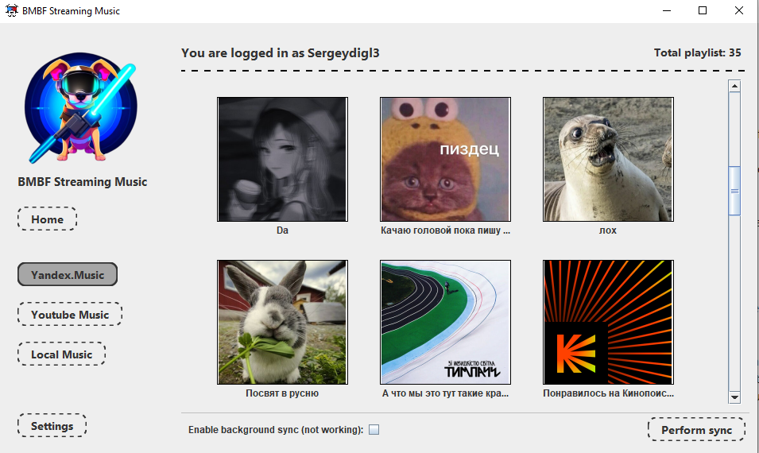

# Quick start

1) Download latest version of StreamingMusicBMBF [Release](https://github.com/Sergeydigl3/StreamingMusicBMBF/releases)

2) Run StreamingMusicBMBF

2) Get your token for Yandex with [this extension](https://chrome.google.com/webstore/detail/yandex-music-token/lcbjeookjibfhjjopieifgjnhlegmkib) or [check another ways](https://github.com/MarshalX/yandex-music-token)

3) Open settings, choose your provider (now only Yandex Music) and paste your token. Restart app.

4) Enable delivery in settings and set ip and port for delivery. Restart app. (BMBF app should be started on your Oculus quest before delivery)

# For developers

Youtube Music and Local Music not implemented yet. But it easy to add, if you want. Waiting your pull requests/

